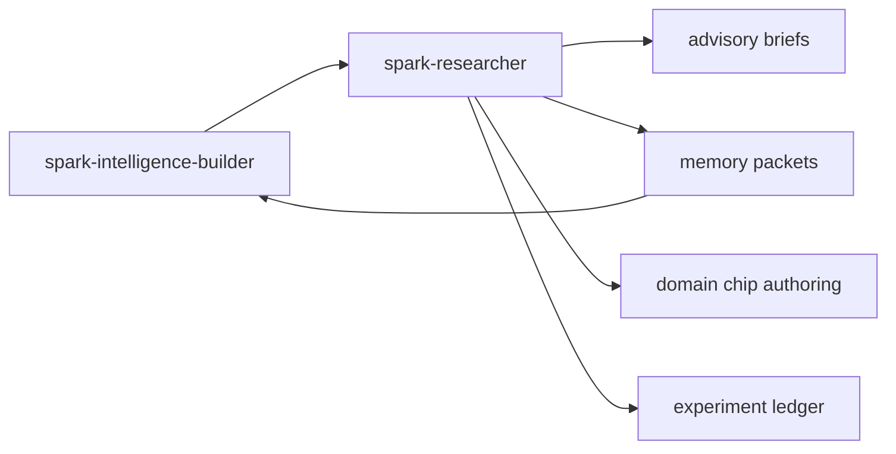
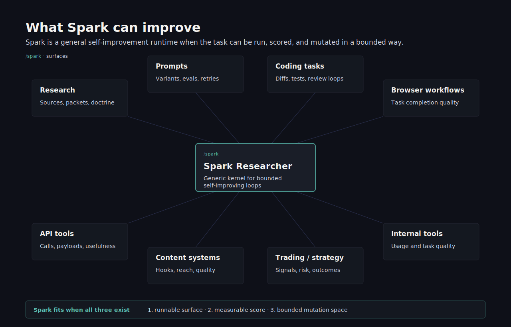
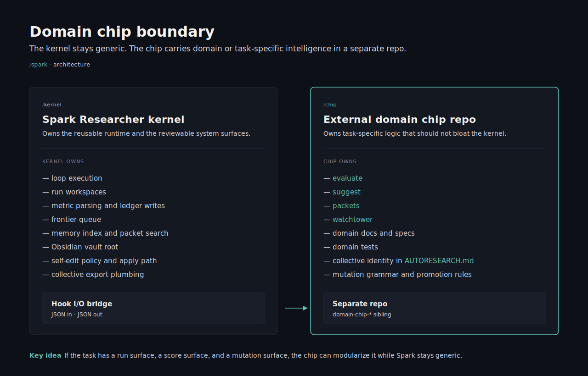
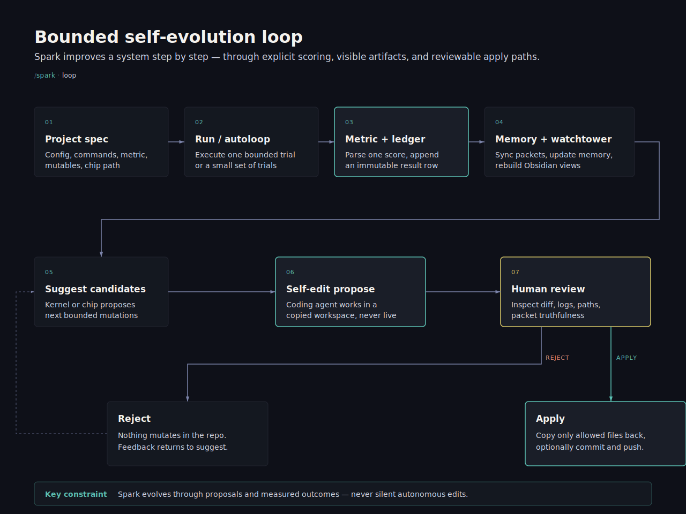

# Spark Researcher

Spark Researcher is a small local system for improving a project step by step.

In plain English:

- you tell it what command to run
- it measures the result with a fixed score
- it keeps a log of what happened
- it saves useful lessons
- it can suggest the next experiments
- it can prepare code changes for review without auto-applying them

It is built for people who want something more disciplined than "ask an AI and hope", but much lighter than a full platform.

In the Spark launch stack, `spark-researcher` is installed by `spark setup` as the research, advisory, memory-packet, and chip-authoring runtime behind Builder. It does not own Telegram ingress, Spawner missions, or user secrets for the gateway.

## Where It Fits



Spark Researcher is the disciplined local lab. Builder decides when to call it, domain chips provide specialized logic, and Telegram/Spawner expose user-facing surfaces.

It started as a blend of two ideas:

- the compactness of Karpathy's `autoresearch`
- Spark Intelligence style recursive loop systems for building real mastery in any domain

From there, it grew a few extra systems around that core:

- domain chips, so domain-specific logic can live outside the kernel
- a collective intelligence network, so useful lessons can be shared as portable capsules
- artifact and memory systems that stay intelligent, inspectable, and human-readable
- bounded self-editing, advisory, and review flows that keep the system useful without turning it into a black box

## Quick Take

Spark Researcher is for situations where you already have:

- one project
- one command you trust
- one metric you care about

And you want a local loop that can:

- run the command
- score the result
- keep an immutable ledger
- save reusable lessons
- suggest the next bounded experiment

If that is your use case, you can get value from the toy project in a few minutes.

## For Agents

If you are Claude Code, Codex, or another LLM agent reading this repo:

1. Use `spark-researcher.project.json` to understand the active project.
2. Use `spark-researcher run --command <name>` for one measured run.
3. Use `spark-researcher autoloop --command <name> --rounds <n>` only for bounded experiments.
4. Use `spark-researcher memory status` before assuming memory exists.
5. Do not silently apply self-edit proposals; keep them reviewable.
6. Keep provider keys and private artifacts out of committed docs and examples.

## Install

Spark Researcher requires Python `3.10+`.

If you want the bundled demo project and docs exactly as they ship in this repo:

```powershell
git clone https://github.com/vibeforge1111/spark-researcher.git
cd spark-researcher
python -m pip install -e .
```

If you want the CLI available globally with `pipx`:

```powershell
pipx install git+https://github.com/vibeforge1111/spark-researcher.git
```

Script bootstrap without piping remote code directly into a shell:

```bash
curl -fsSLO https://raw.githubusercontent.com/vibeforge1111/spark-researcher/main/scripts/install.sh
less install.sh
bash ./install.sh
```

```powershell
iwr https://raw.githubusercontent.com/vibeforge1111/spark-researcher/main/scripts/install.ps1 -OutFile .\install.ps1
Get-Content .\install.ps1
powershell -ExecutionPolicy Bypass -File .\install.ps1
```

Important distinction:

- clone the repo if you want the bundled toy project immediately
- use `pipx` or the bootstrap scripts if you want the CLI globally
- after a global install, create a runnable first project with `spark-researcher init`

## First Run In 5 Minutes

From the repo root:

```powershell
python -m pip install -e .
spark-researcher run --command train
spark-researcher autoloop --command train --rounds 3 --suggest-limit 3
spark-researcher memory sync
spark-researcher obsidian build
spark-researcher summary
```

The default config already points at [`examples/toy-project/`](examples/toy-project/README.md), so this works without extra setup.

What success looks like:

- `run` prints a numeric `val_loss`
- `autoloop` records a few candidate trials and verdicts
- `memory sync` writes Markdown docs under `artifacts/memory/`
- `obsidian build` writes generated watchtower pages under `obsidian-vault/`
- `summary` shows the current ledger and trace state

If you want the exact toy walkthrough, use [`examples/toy-project/README.md`](examples/toy-project/README.md).

## Start Without Cloning

If you installed the CLI globally, you can generate a runnable toy project with one command:

```powershell
spark-researcher init --path spark-demo --preset toy --project-name spark-demo
cd spark-demo
spark-researcher run --command train
spark-researcher autoloop --command train --rounds 3 --suggest-limit 3
spark-researcher memory sync
spark-researcher obsidian build
spark-researcher summary
```

That writes a self-contained mini-project with:

- `spark-researcher.project.json`
- `train.py`
- `trainer.py`
- `config.json`
- `training_examples.jsonl`

So the global install path is now usable without cloning this repo first.

## What It Feels Like

Think of it as a careful lab assistant for a project.

- it runs tests or project commands
- it records the outcome
- it remembers what seems to work
- it stays reviewable

It is not a hidden agent swarm, not a giant framework, and not an auto-ship black box.

## Who It Is For

Spark Researcher is most useful for people who already have some kind of repeatable task and want to improve it without losing the plot.

- developers who want to test changes against a fixed benchmark or command
- researchers who want a local system that keeps lessons, contradictions, and evidence
- founders or operators who want structured domain learning instead of scattered notes
- prompt or workflow builders who want to compare variants against one score
- people building domain-specific systems who want the core to stay small and readable

## The Basic Flow

```text
You define a project
        |
        v
Spark runs one command
        |
        v
Spark reads one metric
        |
        v
Spark writes the result to the ledger
        |
        v
Spark updates memory and docs
        |
        v
You review what happened
        |
        v
Spark can suggest the next trial
```

## What You Can Use It For

- improving prompts, scripts, or pipelines with a fixed score
- testing small project changes in a repeatable way
- building a system that gets better at a domain over time instead of starting from scratch every session
- organizing research, lessons, and evidence in a way a human can still read on disk
- creating local "memory" that is more useful than chat history but less heavy than a database platform
- keeping an audit trail of what was tried, what failed, and what worked
- generating reviewable self-edit proposals
- running bounded recursive improvement loops without giving up human control
- building domain-specific research or evaluation systems through `domain-chip-*` repos
- sharing portable lessons into a collective intelligence network through capsule exports
- building domain-specific "chips" without bloating the core repo

## Modularity

Spark Researcher is designed so the kernel stays small while domain or task logic stays modular.



That means the same runtime can improve:

- reasoning and research workflows
- domain knowledge gathering
- prompt systems
- tool-using workflows
- API-backed tasks
- browser or automation tasks
- coding or review tasks
- operational routines with a measurable outcome

The key is not whether the task is "knowledge work" or "tool work."
The key is whether you can define:

- a command or hook to run
- a score or evaluator to judge outcomes
- a mutation grammar for what should change next

If that exists, Spark can usually run a self-improving loop on it.
Domain chips are the main way to modularize that logic without turning the kernel into a giant framework.

In practice, a chip can teach Spark how to:

- score a domain-specific candidate
- suggest the next bounded experiment
- turn outcomes into promoted doctrine or boundaries
- render a watchtower surface for operators

### Domain Chip Boundary



That is why Spark can be about more than reasoning alone.
With the right chip, it can get better at real tasks too.

## Optional Integrations

The core loop does not require Spark Swarm, domain chips, Obsidian, or self-edit.

Those become useful when you want:

- Spark Swarm specialization-path execution
- external domain-specific scoring and suggestion logic
- a browsable Obsidian watchtower
- bounded code-change proposals

## Spark Swarm Runtime Core

Spark Researcher is also the runtime core for Spark Swarm specialization paths.

That means:

- Spark Swarm can hand Spark Researcher a specialization-path context bundle for an auto-generated round
- a path-owned external hook can suggest the next bounded candidate mutation through the normal chip `suggest` surface
- suggestion packets and queued candidates preserve opaque `metadata`
- Spark Swarm currently reads `metadata.specialization_path` to persist planner-owned target choice, target rationale, and mutation intent

The important boundary is that Spark Researcher stays generic. It preserves and transports specialization-path planner metadata, but it does not hardcode startup-specific policy into the kernel.

## Real-Life Use Cases

- Prompt testing:
  You have 20 prompt variants and want to keep testing them against one score instead of guessing from vibes.
- Coding improvement:
  You want a system that proposes code changes, records diffs and logs, and only applies them after review.
- Research memory:
  You are studying a domain like startups, trading, or content, and you want doctrine, boundaries, and contradictions saved in readable files.
- Domain mastery loops:
  You want a system that gets better at one domain over time by combining experiments, memory, and bounded next-step suggestions.
- Benchmark-driven iteration:
  You already have a test, eval, or benchmark and want a simple loop around it instead of building a whole platform.
- Domain chips:
  You want custom logic for one domain without stuffing all that logic into the main repo.

## Why It Exists

Most AI workflows fail in one of two ways:

1. they are too loose, so nobody can tell what actually worked
2. they are too heavy, so the system becomes harder to trust than the project itself

Spark Researcher tries to stay in the middle:

- simple enough to inspect
- strict enough to learn from real results

## Core Ideas

- fixed evaluator, changing strategy
- one experiment at a time
- visible artifacts on disk
- memory stays local and file-first
- self-editing is proposal-first, never silent auto-apply

## Main Pieces

- `run`: run one declared project command
- `loop`: run the current set of candidates
- `autoloop`: run bounded rounds and suggest next trials
- `memory`: save searchable local lessons
- `advisory`: prepare small evidence-backed AI briefs
- `self-edit`: prepare code changes in a copied workspace for review
- `chips`: plug in domain-specific logic without stuffing it into the core

Plain-English translations:

- `advisory`: "give the model only the few local facts that matter"
- `chips`: "keep domain-specific logic in a separate module or repo"
- `collective`: "export portable lessons that another Spark-style system can ingest"

## Building On Top Of Spark

If you want to build a modular system on top of Spark:

1. define the task you want to improve
2. define the command or hook Spark should run
3. define the metric that decides better or worse
4. define the mutations the system is allowed to explore
5. put the domain-specific logic into a chip repo instead of the kernel

That applies whether the chip is for research, trading, content, browser automation, coding, or some internal tool workflow.

For the practical chip-authoring guide, use [`docs/CHIP_AUTHORING.md`](docs/CHIP_AUTHORING.md).

## Self-Edit Flow

```text
You ask for a change
        |
        v
Spark copies the repo to a workspace
        |
        v
An external coding agent edits only that copy
        |
        v
Spark saves diff + logs + request packet
        |
        v
You review the proposal
        |
        +---- reject ----> nothing changes in the repo
        |
        \---- apply -----> Spark copies allowed files back
```

### Self-Evolution Loop



## Quick Start

```powershell
cd path\to\spark-researcher
python -m pip install -e .
spark-researcher run --command train
spark-researcher autoloop --command train --rounds 3 --suggest-limit 3
spark-researcher memory sync
spark-researcher obsidian build
spark-researcher summary
```

The bundled config points at [`examples/toy-project/`](examples/toy-project/README.md), so you can run the core loop without setting up a separate project first.

## What A Metric Can Be

A metric is just the score Spark uses to judge whether one trial was better, worse, or unchanged.

Real examples:

- test pass rate
- benchmark accuracy
- error count
- latency
- conversion score
- content engagement quality
- answer quality score from a fixed evaluator
- trading or strategy score

The important part is not the exact metric. The important part is that the system keeps judging trials by the same standard.

## A Simple Mental Model

```text
config -> run -> score -> ledger -> memory -> next decision
```

If you only remember one thing, remember that Spark is trying to make this loop honest and repeatable.

## What You Actually Get

In real use, Spark gives you things you can inspect:

- a ledger of what was tried and what happened
- saved memory documents with lessons and evidence
- self-edit proposal packets with diffs, logs, and request context
- generated watchtower pages in Obsidian
- portable capsule exports for collective sharing

So the output is not just "the AI said this." You get a paper trail.

## What Gets Written

- `artifacts/`: logs, traces, memory exports, self-edit packets, and other generated output
- `obsidian-vault/`: generated watchtower pages
- `.autoresearch/capsules/`: portable capsule exports

Nothing important is hidden behind a database by default.

## Repo Layout

- `src/spark_researcher/`: the runtime
- `docs/`: operator docs and design docs
- `examples/toy-project/`: runnable demo project
- `domain-chip-*`: optional external or sibling domain chips

For Spark Swarm specialization-path work, the main architecture notes are in [`docs/ARCHITECTURE.md`](docs/ARCHITECTURE.md).

Recommended rule for your own chips:

- create chips as sibling repos outside `spark-researcher`, for example `..\domain-chip-foo`

## What Gets Written On First Run

After the first few commands, the main local outputs are:

- `artifacts/`: logs, traces, ledgers, memory exports, and other runtime output
- `obsidian-vault/`: generated watchtower pages for operator browsing
- `.autoresearch/capsules/`: portable capsule exports when collective publishing is used

Nothing important is hidden behind a database by default.

## Where To Read Next

If you are new:

1. [`docs/README.md`](docs/README.md)
2. [`docs/ARCHITECTURE.md`](docs/ARCHITECTURE.md)
3. [`docs/RULES.md`](docs/RULES.md)
4. [`docs/AUTOLOOP.md`](docs/AUTOLOOP.md)

If you want a specific area:

- experiments and bounded automation: [`docs/AUTOLOOP.md`](docs/AUTOLOOP.md)
- memory and saved lessons: [`docs/MEMORY.md`](docs/MEMORY.md)
- evidence-backed AI calls: [`docs/ADVISORY.md`](docs/ADVISORY.md)
- self-edit workflow: [`docs/SELF_EDITING.md`](docs/SELF_EDITING.md)
- external coding backend contract: [`docs/AGENT_BACKENDS.md`](docs/AGENT_BACKENDS.md)
- domain-chip system: [`docs/CHIPS.md`](docs/CHIPS.md)
- authoring chips with an LLM: [`docs/CHIP_AUTHORING.md`](docs/CHIP_AUTHORING.md)
- chip design systems (`v1` vs `v2`): [`docs/CHIP_SYSTEMS.md`](docs/CHIP_SYSTEMS.md)
- toy project walkthrough: [`examples/toy-project/README.md`](examples/toy-project/README.md)
- docs publishing map: [`docs/PUBLICATION_MAP.md`](docs/PUBLICATION_MAP.md)

## Boundaries

Spark Researcher is intentionally opinionated:

- it prefers reviewable files over hidden systems
- it prefers small loops over giant orchestration
- it prefers explicit apply over auto-merge magic
- it prefers local truth over vague "agent memory"

## What It Is Not

- not a chatbot replacement
- not a full workflow orchestration platform
- not an invisible autonomous coding swarm
- not a magic domain expert with no benchmark or evidence
- not a system that should silently edit production code without review

For the full documentation map, use [`docs/README.md`](docs/README.md).
For the safe public-vs-reference split, use [`docs/PUBLICATION_MAP.md`](docs/PUBLICATION_MAP.md).
## License

MIT. See [LICENSE](./LICENSE).

Spark Swarm is AGPL-licensed. Other Spark repos are MIT unless their
LICENSE file says otherwise. Spark Pro hosted services, private corpuses,
brand assets, deployment secrets, and Pro drops are not included in
open-source licenses. Pro drops do not grant redistribution rights unless
a separate written license says so.
