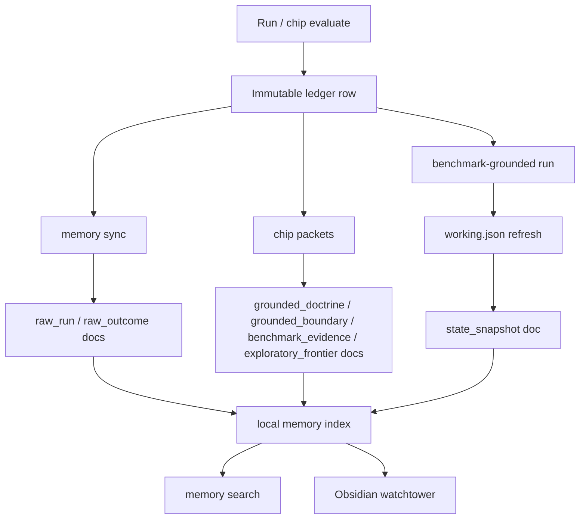

# Architecture

Spark Researcher is intentionally small.

## Core Flow

1. Load `spark-researcher.project.json`.
2. Overlay generated candidates from `artifacts/frontier/queue.json` when present.
3. Copy the target project into a run workspace.
4. Apply one explicit mutation set.
5. Run one declared command.
6. Parse one fixed metric.
7. Append one immutable ledger row.
8. Emit lightweight trace artifacts for the run and related decisions.
9. Export memory docs and rebuild the Obsidian vault when needed.

## Spark Swarm Specialization-Path Contract

Spark Researcher now has a second important runtime role: it is the generic execution core for Spark Swarm specialization paths.

That contract is intentionally narrow:

- Spark Swarm writes a specialization-path runtime bundle and invokes a normal chip `suggest` hook
- the path-owned repo reads that bundle and returns one or more bounded candidate suggestions
- Spark Researcher preserves suggestion `metadata` in both suggestion packets and queued candidate trials
- Spark Swarm consumes `metadata.specialization_path` for planner-owned fields like selected target index, selected target path, selected target reason, and mutation intent

The boundary matters:

- Spark Researcher preserves planner semantics
- Spark Swarm interprets them inside the specialization-path control plane
- path-owned repos keep domain-specific doctrine, copy, templates, and benchmark defaults outside the kernel

This keeps the runtime reusable for future specialization paths without turning the core repo into a startup-only system.

## Memory Flow

Memory is file-first and tiered.

- raw runs and outcomes are the audit trail
- chips can promote domain documents into explicit memory tiers
- working memory is the live state snapshot, not the long-term source of truth

## Memory Tiers

- `grounded_doctrine`: reusable doctrine that cleared a fixed evaluator
- `research_grounded`: source-grounded packets extracted from strong external materials
- `grounded_boundary`: weakest grounded transfer surface or failure boundary worth remembering
- `benchmark_evidence`: benchmark-backed evidence docs that support doctrine
- `exploratory_frontier`: explicit exploratory probes that should not be treated as grounded doctrine
- `state_snapshot`: current working memory summary
- `raw_outcome`: compact candidate outcome history
- `raw_run`: full run history and trace-adjacent operational residue

## Layers

- `runner.py`: command execution, mutations, verdicts, ledger writes
- `failures.py`: concrete failure registry and surprise-priority scoring
- `tracing.py`: JSONL trace recorder for run, advisory, frontier, and self-edit flows
- `research.py`: one-pass bounded research retry that turns `research_needed` into dated web notes with lightweight source provenance plus one follow-up verifier pass
- `verifier.py`: bounded two-draft select-and-revise loop for advisory execution, aware of active surprise-priority failure surfaces and able to escalate time-sensitive misses into `research_needed`
- `trainers.py`: generic example-count watchers with bounded recompiles
- `candidates.py`: now uses recent surprising failures to bias repair-oriented suggestion ordering and preserves candidate metadata for downstream runtimes like Spark Swarm specialization paths
- `trial_queue.py`: keeps generated frontier state out of the hand-authored project config
- `memory.py`: tiered Markdown memory export and lexical search
- `obsidian.py`: watchtower generation
- `collective.py`: portable capsule export
- `self_edit.py`: workspace-only self-edit proposals with explicit apply
- `presets.py`: multi-domain scaffolding without adding framework weight
- `chips.py`: external domain-chip bridge over a tiny manifest contract

## Non-Goals

- no hidden background daemon
- no database requirement
- no framework-heavy plugin system
- no auto-merge of self edits
- no domain logic hardcoded into the core when a chip can hold it

## Config Boundary

- `spark-researcher.project.json` is the stable project spec
- `artifacts/frontier/queue.json` is the generated runtime queue

Candidate metadata is intentionally allowed to pass through both layers unchanged so runtime integrations can preserve planner-owned context without editing the kernel for each domain.

This keeps the repo file-first and resumable without turning the main config into a residue log of every autoloop suggestion.
