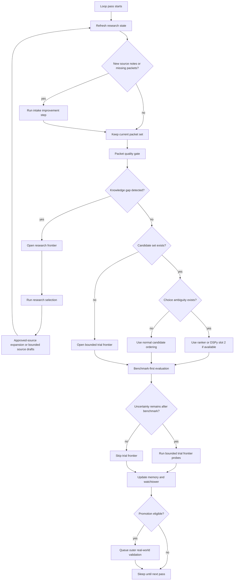

# Chip One-Loop Flywheel

Use this guide when a chip has moved beyond simple evaluation hooks and now needs a stronger learning loop.

This is the portable version of the richer startup-chip design.

The goal is:

- one governing loop
- several conditional stages
- no flat "run everything every pass" design

This pattern helps a chip combine:

- source learning
- packeting
- benchmarks
- bounded exploration
- memory
- outer validation
- optional DSPy help

For packet-heavy chips, the loop should also make packet metadata policy explicit:

- required structural metadata should be fully populated across the corpus
- optional hint fields should improve over time without being forced by weak guesses

## Core Rule

A mature chip should have one governing loop, not many disconnected loops.

That loop should decide what to do from state.

It should not run every subsystem on every pass just because those subsystems exist.

For continuous loops, the runtime should also expose lightweight pass timing:

- pass started / finished
- work duration
- whether the pass was productive
- when the next wake-up is expected

And productive passes should be allowed to rerun quickly instead of always sleeping the full configured pause interval.

## Why This Matters

Without this pattern, chips drift into:

- research accumulation without testing
- benchmarks without source learning
- frontier mutation without knowledge growth
- DSPy side systems that do not affect the main loop cleanly
- watchtower pages that describe parts of the system but not the flywheel

## The Generic Flywheel

## Always-On Stages

These should run every pass:

1. research refresh
2. packet quality gate
3. memory update
4. watchtower update

These are the minimum stable heartbeat of a serious chip loop.

## Conditional Stages

These should run only when the chip state justifies them.

### Intake Improvement

Run when:

- new source notes exist
- packet coverage is missing
- packet extraction quality needs recalibration

This is where packet-extractor DSPy usually belongs if a chip has it.

If a chip adds slot-1 autorun inside the live loop:

- keep it opt-in
- only trigger it when that pass created new source notes or draft packets
- write explicit autorun status into artifacts and watchtower pages
- never treat model output alone as automatic packet promotion

### Research Frontier

Run when the chip has a knowledge gap, not just a trial gap.

Examples:

- repeated failure shapes are underexplained by current packet coverage
- important source areas are thin
- packet count looks fine but doctrine depth is still weak
- a benchmark boundary is clear but the mechanism behind it is not well covered by research

Outputs:

- approved-source queue items
- bounded source-note drafts
- new packet opportunities

It should not emit doctrine directly.

### Research Selection

Research selection is the source-choice layer that sits between "we need more knowledge" and "go fetch more sources."

It should:

- read coverage and doctrine-depth state
- identify which underweighted areas matter most
- choose the next best source candidates from trusted seeds
- emit ranked fallback targets when exact sources are not yet available

Keep this separate from discovery:

- selection decides what to learn next and why
- discovery only fetches or drafts sources from that bounded decision surface

### Doctrine Review

When a chip already has decent broad coverage, it also needs a novelty-pressure stage so it does not keep circling the same doctrine families forever.

The reusable pattern is:

- every `15` research runs, review doctrine and coverage distribution
- recommend up to `3` doctrine directions to broaden
- recommend up to `2` coverage areas to broaden
- optionally let DSPy select from those candidate directions
- use those outputs to steer research selection and bounded discovery

This stage should:

- identify crowded doctrine tags
- identify underweighted doctrine tags
- identify underweighted coverage areas
- prefer source expansion that broadens doctrine territory, not just source count

DSPy should remain bounded here:

- it may choose among candidate doctrine/coverage directions
- it should not automatically mutate the stable doctrine registry

### Benchmark Path

Run when:

- packet-derived doctrine can be expressed as benchmark-compatible candidates
- or promoted doctrine needs stronger grounding

This is the chip's main inner truth surface when a benchmark exists.

One practical lesson from the startup chip:

- once a packet has been deepened enough, the loop needs a real `ready_for_benchmark` handoff
- that handoff should emit fresh benchmark candidates, not just a nicer state label

If the chip dedupes benchmark work only by a coarse signature like:

- benchmark profile
- baseline/operator id

then deepened doctrine can get stuck, because the loop thinks the benchmark was "already tried."

The healthier pattern is:

- keep the benchmark facts layer unchanged
- but let packet-derived benchmark candidates carry a doctrine anchor

That doctrine anchor can be:

- packet id
- plus a compact hash of the current claim/mechanism/boundary state

This allows the chip to treat:

- "same benchmark surface, newly deepened doctrine"

as fresh benchmark work without forcing the benchmark system itself to understand doctrine semantics.

### Trial Frontier

Run when:

- benchmark leaves uncertainty
- boundaries need pressure-testing
- or no clean benchmark move exists yet

This lane is exploratory and must remain bounded.

### Outer Real-World Validation

Run only when:

- doctrine is promoted and benchmark-grounded by default
- or a human explicitly escalates strategically important research-grounded doctrine

This lane should be slower and more selective than the inner loop.

## The Two Frontier Types

Every richer chip should explicitly separate frontier into:

- `research_frontier`
- `trial_frontier`

This is one of the most important lessons from the startup chip.

If a chip uses trial frontier to compensate for research ignorance, the loop gets noisy.

If a chip uses research frontier when it really needs boundary testing, the loop gets slow and evasive.

So the chip must ask:

- do we need more knowledge?
- or do we need more testing?

And inside research frontier it must ask:

- do we need more sources because coverage is missing?
- or do we need better sources because doctrine depth is still too weak?

## DSPy Placement

DSPy should help narrow loop stages, not become the loop.

Best placements:

- slot 1: source or near-source note -> structured packet
- slot 2: candidate set + context -> best next probe

DSPy should be conditional:

- slot 1 only when new intake work exists
- slot 2 only when ranking a real choice set matters

## Benchmark Bridge

If a chip has a benchmark lane, connect it to chip promotion using a small bridge artifact or equivalent bridge semantics.

Use:

- `docs/CHIP_BENCHMARK_BRIDGE_GUIDE.md`

Do not let:

- benchmark reports act as doctrine
- or chip memory act as benchmark truth

## Evidence Lanes

At minimum, keep these distinct:

- `research_grounded`
- `benchmark_grounded`
- `exploratory_frontier`
- `realworld_validated`

The system gets worse when these lanes share one verdict surface.

## Coverage And Depth

Do not treat research coverage as a raw packet count problem only.

Each richer chip should track at least:

- packet count by research area
- doctrine depth by research area
- overcrowded or repetitive areas

This helps the loop avoid two bad behaviors:

- declaring an area "done" too early because it has a few packets
- overfilling already-crowded areas while other areas are still thin

Healthy order:

1. fill true gaps
2. deepen shallow doctrine
3. avoid repetitive source expansion in already-crowded areas unless depth is still weak

This usually means the loop should ask:

- do we need more sources for this area?
- or do we need better sources because the doctrine is still thin?

## Promotion Rule

Promotion should follow this pattern:

1. source learning
2. packeting
3. benchmark grounding
4. doctrine or boundary candidate
5. outer real-world validation

Do not skip from research residue to durable doctrine.

## What Transfers Across Chips

Portable:

- one governing loop
- research frontier vs trial frontier
- benchmark bridge
- memory and watchtower update as always-on stages
- conditional DSPy slots
- outer validation gating

Domain-specific:

- source families
- packet vocabulary
- benchmark tasks
- contradiction tags
- outer real-world tasks

## Acceptance Check

A chip is using the one-loop flywheel well only if:

1. it has one governing loop, not disconnected research / benchmark / DSPy loops
2. it can tell the difference between a knowledge gap and a trial gap
3. it separates research frontier from trial frontier
4. DSPy is conditional and narrow
5. benchmark grounding is not the only lane, but it is still the main inner truth surface when present
6. stronger doctrine has a path into outer real-world validation

## Related Docs

- `docs/CHIP_INTELLIGENCE_CONTRACT.md`
- `docs/CHIP_INTELLIGENCE_ROLLOUT.md`
- `docs/CHIP_DSPY_METHOD.md`
- `docs/CHIP_BENCHMARK_BRIDGE_GUIDE.md`
- `docs/CHIP_RESEARCH_PACKET_SCHEMA.md`
