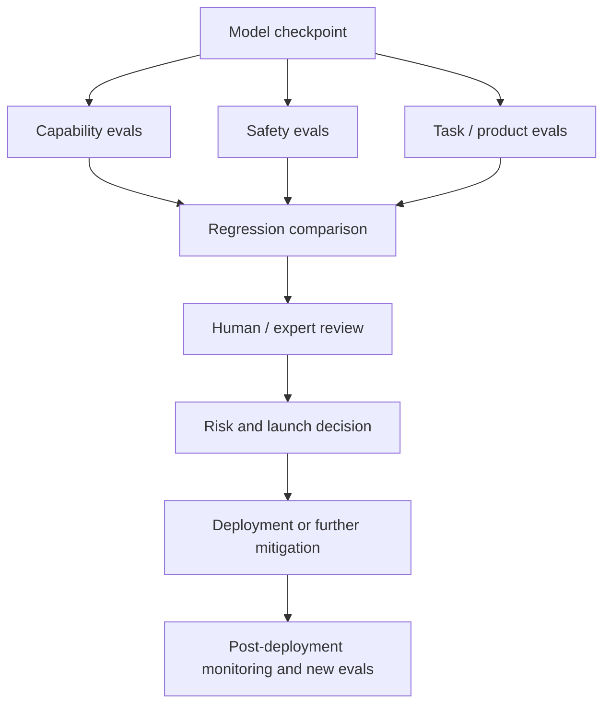
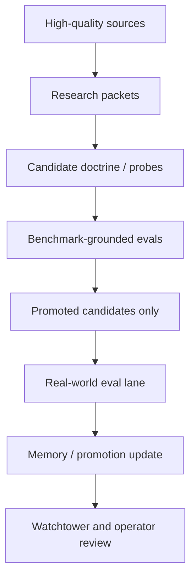

# Frontier Lab Benchmarking Book

This document explains, in plain language, how benchmarking and evaluation usually work inside frontier AI labs, why they use many benchmarking systems at once, and how that maps back to Spark Researcher.

It is not an inside leak or a claim about any one private lab's exact internal stack. It is a public reconstruction based on official materials from OpenAI, Anthropic, and Google DeepMind, plus careful inference from what those materials imply.

## Core Idea

Frontier labs do not usually have one benchmark that tells them whether a model is "good."

They usually have an evaluation stack:

- capability benchmarks
- product or task evaluations
- safety evaluations
- regression suites
- red-team exercises
- expert and human grading loops
- governance reviews that decide whether a model is safe enough to train further or deploy

The important point is this:

benchmarking is not a side activity. It is one of the main ways labs decide whether progress is real, whether a change is safe, and whether a model is ready for deployment.

## Why Labs Need So Many Benchmarks

One benchmark is never enough because every benchmark has failure modes.

A single benchmark can:

- be overfit
- measure the wrong thing
- become stale
- reward surface tricks instead of real capability
- hide regressions in adjacent areas

So labs build multiple kinds of evaluation systems at once.

The practical logic is:

- one eval may show raw capability
- another may show usefulness on real tasks
- another may show whether the model became riskier
- another may detect that a safety improvement quietly damaged quality

This is why a serious lab usually cares less about one leaderboard number and more about the total pattern across many eval surfaces.

## The Main Layers

### 1. Capability Benchmarks

These answer:

- what can the model do?
- how far did it improve?
- where is it strong or weak?

Examples:

- reasoning tests
- coding tests
- scientific problem-solving tasks
- agentic tool-use tasks
- multilingual tasks
- long-context tasks

These are often the most visible public benchmarks, but they are only one layer.

### 2. Task Or Product Evals

These answer:

- how well does the model perform on the work people actually want done?

Examples:

- coding interviews or engineering tasks
- workplace deliverables
- medical interactions
- browser or agent tasks
- customer support or business tasks

These tend to matter more than pure benchmark scores once a lab is trying to ship real systems.

### 3. Safety Evals

These answer:

- did the model become more dangerous?
- can it help with misuse?
- can it be manipulated?
- do mitigations still work?

Examples:

- bio or chemical misuse evaluations
- cyber capability evaluations
- policy refusal tests
- jailbreak tests
- harmful instruction following
- high-risk agentic behavior

For frontier labs, this layer is not optional. It is often tied directly to deployment gates.

### 4. Regression Evals

These answer:

- what got worse when we improved something else?

Examples:

- quality regressions after safety tuning
- safety regressions after capability tuning
- tool-use regressions after model updates
- refusal regressions or over-refusal shifts

This is one reason labs keep large internal test suites. Improvement is rarely one-directional.

### 5. Human And Expert Grading

These answer:

- did the model actually produce something a strong human would consider good?

Examples:

- experts comparing model work to human work
- domain specialists stress-testing dangerous capabilities
- human raters scoring usefulness, correctness, and quality

This matters because many important tasks are too open-ended to score with simple exact-match metrics.

## What The Evaluation Stack Usually Looks Like

A simplified frontier-lab flow often looks like this:

The important thing is that deployment is not usually justified by one number. It is justified by an evidence bundle.

## Public Versus Private Evals

Labs usually have both.

### Public evals

These are useful for:

- communicating progress
- comparing against other labs
- contributing to the broader field

But public evals decay quickly because models optimize around them.

### Private evals

These are useful for:

- measuring real weaknesses
- preventing benchmark gaming
- catching capabilities the public has not yet operationalized well
- supporting internal go or no-go decisions

The strongest internal evals are often private, hidden, adversarial, or periodically refreshed.

## Why Human Loops Still Matter

Even advanced labs do not rely only on automatic scoring.

They still need:

- expert reviewers
- domain specialists
- red-teamers
- internal safety teams
- launch reviewers

Why:

- many dangerous capabilities are subtle
- many real-world tasks are open-ended
- automated graders can be fooled
- risk judgments often require contextual reasoning, not just a number

So the frontier pattern is not:

- "replace humans with benchmarks"

It is:

- "use benchmarks to structure judgment, then use humans where judgment is still needed"

## What Labs Benchmark Repeatedly

A useful mental model is that labs benchmark at least five things repeatedly:

1. raw model capability
2. model behavior under stress
3. real task usefulness
4. quality of safeguards
5. regressions across versions

This is why evaluation becomes a permanent operational system, not a one-time report.

## How Governance Usually Enters

In frontier labs, evaluation is often tied to governance.

That means some group reviews:

- what was tested
- what the model can do
- what mitigations exist
- what residual risk remains
- whether deployment should proceed

The exact structure differs by lab, but the pattern is similar:

- evaluation produces artifacts
- those artifacts feed decision-makers
- decision-makers can require mitigations, restrict release, or approve deployment

This is important because a benchmark score alone does not decide launch policy. Governance sits on top of the eval stack.

## OpenAI Pattern

Public OpenAI materials show several important patterns.

OpenAI's Preparedness Framework describes:

- tracked risk categories
- capability measurement
- safeguards reports and capability reports
- a Safety Advisory Group
- deployment decisions based on residual risk, not just raw capability

Its system cards also show:

- checkpoint-based testing rather than pretending one frozen model tells the whole story
- safety, capability, and agentic evaluations together
- internal task evals, such as research-engineer interview tasks
- expert testing for high-risk domains

OpenAI also publishes domain-specific evals such as:

- HealthBench
- MLE-bench
- GDPval
- FrontierScience

Inference from these materials:

- OpenAI treats evaluation as a multi-layer operating system, not just benchmark reporting
- internal task evals and expert graders matter a lot
- launch decisions are tied to structured evidence bundles

## Anthropic Pattern

Anthropic's Responsible Scaling Policy makes the role of evaluations especially explicit.

Public materials show:

- evaluation thresholds tied to scaling and deployment decisions
- evaluations designed as conservative warning signs
- progressive difficulty
- reporting of evaluation results to internal governing bodies
- public sharing of some evaluation results after deployment where possible

Inference from these materials:

- Anthropic treats evaluations as part of the scaling control system itself
- evaluations are not only for measurement, but also for deciding what safety regime is required
- governance and evaluation are tightly linked

## Google DeepMind Pattern

Public Gemini model cards show a somewhat different public style, but the same basic stack is visible.

Public materials show:

- benchmark coverage across multiple capability areas
- automated safety evaluations
- manual red teaming by specialist teams outside the core development team
- changing evaluation methodology over time
- emphasis on both capability and safety measurements

Inference from these materials:

- Google DeepMind also runs layered evaluations rather than one benchmark
- model cards are only the public tip of a larger internal evaluation process
- specialist red-teaming and internal thresholding are part of the release discipline

## What "Benchmarking" Really Means In Practice

When people say "labs benchmark models," they often imagine a leaderboard.

What it often means in practice is closer to:

- define an important task
- choose or build a dataset
- choose a scoring rule
- compare models or checkpoints
- stress-test for failure
- review results with humans
- track regressions over time
- decide what to change next

That is much more like a scientific measurement program than a single test.

## Why Benchmarks Keep Changing

Labs keep changing evals because models get better and old tests lose value.

Common reasons to replace or refresh benchmarks:

- saturation
- contamination
- overfitting
- misalignment between benchmark wins and real-world usefulness
- missing new risk modes

This is one reason frontier labs invest in hidden evals and fresh challenge sets.

## How Graders Fit In

A grader is a system used to judge outputs.

It might be:

- rule-based
- human-based
- model-based
- mixed

Graders matter because many useful tasks do not have exact answers.

Examples:

- Is this startup memo clearer than the baseline?
- Is this medical answer both helpful and safe?
- Did this coding solution actually solve the problem robustly?

Frontier labs often invest heavily in grader quality because bad graders create bad optimization targets.

## The Tradeoff Between Speed And Truth

Labs need both:

- fast evals
- trustworthy evals

Fast evals help with:

- iteration
- regression checks
- cheap comparisons

Trustworthy evals help with:

- deployment decisions
- high-risk thresholds
- real-world confidence

The usual compromise is:

- many cheap automatic evals all the time
- fewer expensive expert or human evals when something looks important

## What This Means For Spark

Spark should not try to imitate every frontier-lab mechanism.

It should copy the discipline, not the scale.

The right Spark analogue is:

- source-grounded research packets
- benchmark-grounded evals
- real-world task evals
- tiered memory
- promotion rules
- watchtower visibility
- periodic human review

Spark does not need:

- giant annotation teams
- foundation-model training
- massive hidden eval farms

Spark does need:

- narrow tasks
- honest graders
- separate evidence lanes
- clear promotion thresholds
- regression awareness

## The Right Spark Mapping

Use this mapping:

### Research-grounded lane

Purpose:

- ingest strong external intelligence
- structure it
- turn it into candidate doctrine

Spark analogue:

- research packets
- source notes
- packet quality gates

### Benchmark-grounded lane

Purpose:

- test whether doctrine or probes hold up on a fixed evaluation surface

Spark analogue:

- startup-bench
- coding test suites
- content outcome evals
- domain-specific benchmark tasks

### Real-world eval lane

Purpose:

- test whether benchmark wins actually improve useful work

Spark analogue:

- memo quality
- idea ranking
- failure-boundary detection
- diagnostic questioning

### Promotion layer

Purpose:

- decide what survives

Spark analogue:

- memory tiers
- doctrine promotion
- boundary promotion
- real-world validation status

## The Main Mistake To Avoid

Do not benchmark "intelligence" as a vague whole.

Benchmark:

- tasks
- decisions
- subroutines
- failure detection
- judgment quality

That is how serious systems stay grounded.

## A Good Small-System Benchmarking Loop

For Spark, the best lightweight version looks like this:

The key rule:

- most things should never reach the expensive outer loop
- only promoted candidates should graduate outward

## What Frontier Labs Would Likely Agree With

Based on public materials, a frontier-lab-compatible view would be:

- evals are central, not decorative
- there should be many eval surfaces, not one
- hidden and refreshed evals matter
- human and expert loops still matter
- governance needs eval artifacts
- deployment decisions depend on residual risk and usefulness, not just benchmark wins

That is the correct mental model to carry into Spark.

## Practical Recommendations For Spark

1. Keep separate evidence lanes.
- `research_grounded`
- `benchmark_grounded`
- `realworld_validated`
- `exploratory_frontier`

2. Prefer benchmark-first promotion.
- research packets influence suggestions
- benchmark evals decide whether something becomes eligible
- real-world eval is for promoted candidates only

3. Build a small but real grader discipline.
- exact metrics where possible
- human or model-assisted graders where exact scoring is impossible

4. Refresh evals over time.
- if a benchmark becomes stale or easy, replace or harden it

5. Keep watchtower tied to evidence, not vibes.
- show what was tested
- show what passed
- show what remains exploratory

## Sources

Primary public materials used here:

- [OpenAI Preparedness Framework](https://openai.com/index/updating-our-preparedness-framework/)
- [Preparedness Framework PDF](https://cdn.openai.com/pdf/18a02b5d-6b67-4cec-ab64-68cdfbddebcd/preparedness-framework-v2.pdf)
- [OpenAI o1 System Card](https://openai.com/index/openai-o1-system-card/)
- [GDPval: measuring performance on real-world tasks](https://openai.com/index/gdpval/)
- [HealthBench](https://openai.com/index/healthbench/)
- [MLE-bench](https://openai.com/index/mle-bench/)
- [Anthropic Responsible Scaling Policy](https://www.anthropic.com/responsible-scaling-policy)
- [Anthropic RSP PDF](https://www-cdn.anthropic.com/1adf000c8f675958c2ee23805d91aaade1cd4613/responsible-scaling-policy.pdf)
- [Google DeepMind Gemini 3.1 Pro Model Card](https://deepmind.google/models/model-cards/gemini-3-1-pro/)

## Final Take

The real lesson from frontier labs is not:

- "find one great benchmark"

It is:

- "build an evaluation system that measures capability, usefulness, safety, regressions, and promotion readiness at the same time"

That is the benchmark culture Spark should copy.
