# Article Visuals & Charts Guide

> Each visual below includes a Mermaid diagram (renders on GitHub/Notion/most CMS platforms) plus a **Design Brief** describing the polished version for a designer or Figma.

---

## Visual 1: The Parrot vs The Partner (Hero Illustration)

**Placement:** Top of article, right after the title or within "A cook who never tastes the food"

**Design Brief:**
Split illustration. Left side: a robotic parrot on a perch, surrounded by floating text snippets, repeating the same output over and over — same colors, same shape, no variation. Monochrome or muted tones. Label: "Most AI today."

Right side: a craftsman at a clean workbench, with a small number of pinned notes on the wall behind them, a project in progress, and a trash bin with crossed-out notes. Warm tones, natural wood textures. Label: "Spark agents."

Style: editorial illustration, slightly whimsical, approachable. Think Stripe's or Linear's blog illustration style.

---

## Visual 2: The Three-Repo Ecosystem

**Placement:** "Three repos, one mission" section

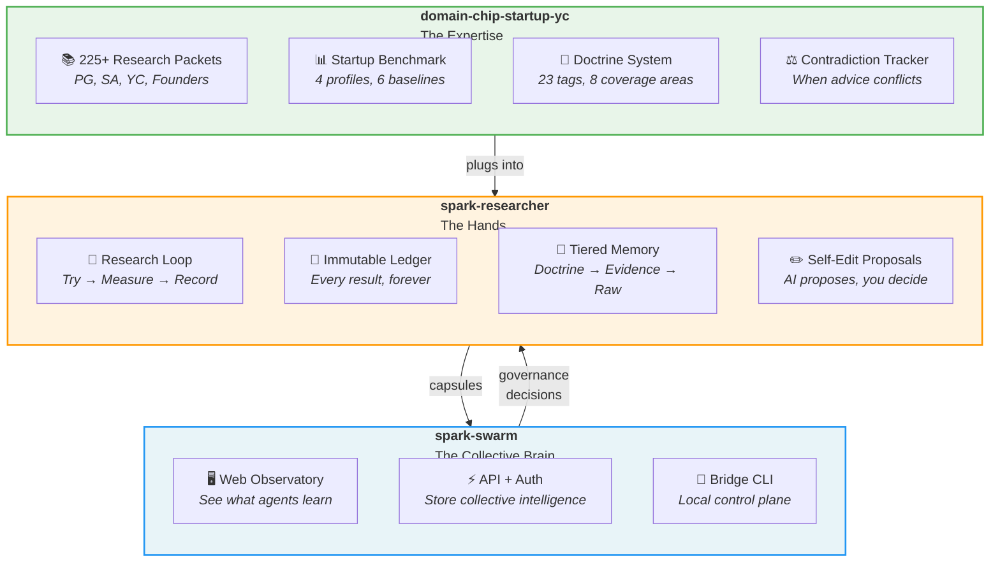

**Design Brief:**
Three nested/connected containers with distinct colors. Outermost = spark-swarm (blue). Middle = spark-researcher (amber/orange). Inner = domain chip (green). Show arrows flowing: chip feeds into researcher, researcher exports capsules to swarm, swarm sends governance decisions back. Clean, flat design. Each container lists 3-4 components with simple icons.

---

## Visual 3: The Learning Loop (Core Product Cycle)

**Placement:** Between "Three repos" and the Skills comparison, or as a standalone callout

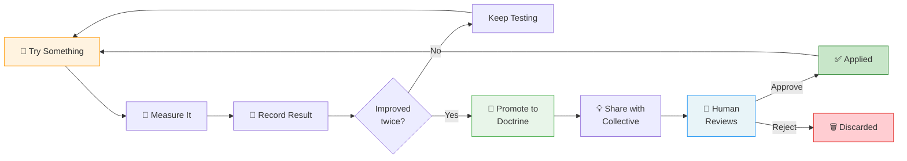

**Design Brief:**
Circular flow diagram. Warm-toned left half = "Agent works" (try, measure, record). Green center = "Knowledge hardens" (promote to doctrine). Blue right half = "Human governs" (review, approve/reject). The circle closes back to "Try Something." Key callout bubble at the center: "Nothing persists without evidence + human approval."

---

## Visual 4: The Memory Pyramid

**Placement:** "Isn't this just fine-tuning?" section

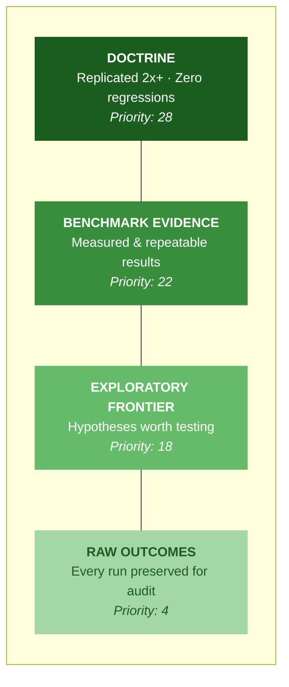

**Design Brief:**
A 4-tier pyramid or stacked bar. Darkest at top (doctrine — smallest, most valuable). Lightest at bottom (raw — largest, least prioritized). Each tier shows: name, entry criteria, and priority score. Right side annotation: "Every piece is a readable document. No black box." Contrast callout comparing to fine-tuning: a solid black rectangle labeled "Fine-tuned weights: permanent ink, no inspection, no undo."

---

## Visual 5: Skills vs Spark Comparison

**Placement:** "How is this different from Claude Skills" section — replace or supplement the table

```mermaid
graph LR
    subgraph SKILLS["Claude / OpenClaw Skills"]
        direction TB
        S1["📖 Written by humans"]
        S2["📌 Static over time"]
        S3["❌ No failure memory"]
        S4["🔒 Each skill isolated"]
        S5["📋 Permission-based"]
    end

    subgraph SPARK["Spark Agents"]
        direction TB
        P1["🔬 Earned through research"]
        P2["📈 Evolves continuously"]
        P3["⚖️ Tracks contradictions"]
        P4["🌐 Collective sharing"]
        P5["📊 Evidence-based"]
    end

    SKILLS -.->|"cookbook<br/>vs<br/>culinary school"| SPARK

    style SKILLS fill:#f5f5f5,stroke:#9E9E9E,stroke-width:2px
    style SPARK fill:#e8f5e9,stroke:#4CAF50,stroke-width:2px
```

**Design Brief:**
Side-by-side comparison card. Left card (gray, flat): "Skills = Cookbook" with 5 bullet points showing static nature. Right card (green, slightly elevated/glowing): "Spark = Culinary School" with 5 bullet points showing dynamic learning. A bridge arrow between them labeled "cookbook vs culinary school." Use icons for each bullet. Clean, marketing-page style.

---

## Visual 6: The User Journey Timeline

**Placement:** "What does this actually look like in practice?" section

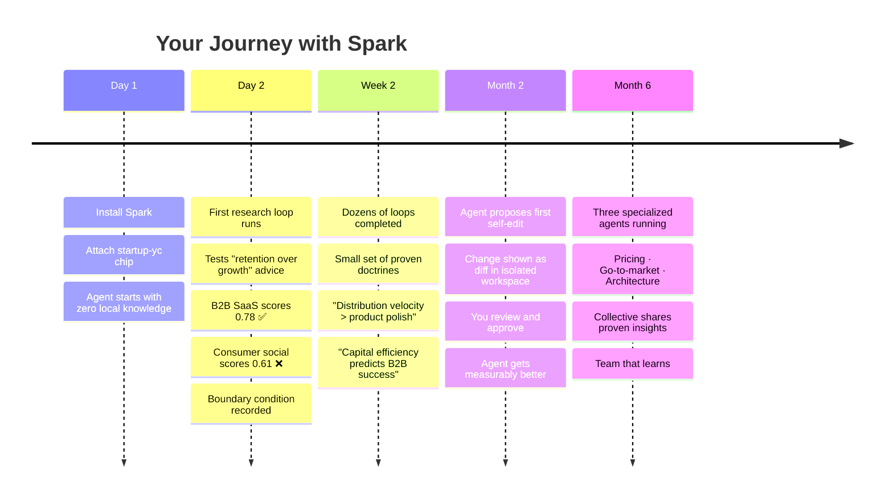

**Design Brief:**
Horizontal timeline with 5 milestones. Each milestone is a card with a date badge and 2-3 key events. Color progression from light (Day 1 = setup) to rich (Month 6 = full collective). The final card should feel like a payoff moment — slightly larger, with a glow or highlight. Include small data points (0.78 score, number of doctrines) to make it feel real, not theoretical.

---

## Visual 7: The Governance Spectrum

**Placement:** Within "Three repos" section under spark-swarm, or in "Workshop owner principle"

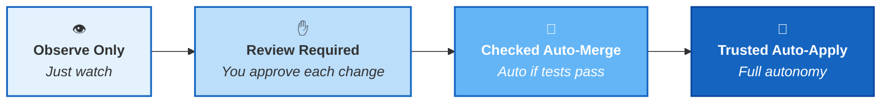

**Design Brief:**
Horizontal slider or gradient bar with 4 stops. Left = maximum human control (lightest blue, lock icon). Right = maximum agent autonomy (deepest blue, rocket icon). Each stop has a label and one-line description. Below the bar, a callout: "You choose your comfort level. The system respects it." This should feel empowering, not scary — the user is always in control.

---

## Visual 8: The Doctrine Promotion Funnel

**Placement:** Supplementary visual for the "fine-tuning" section or sidebar

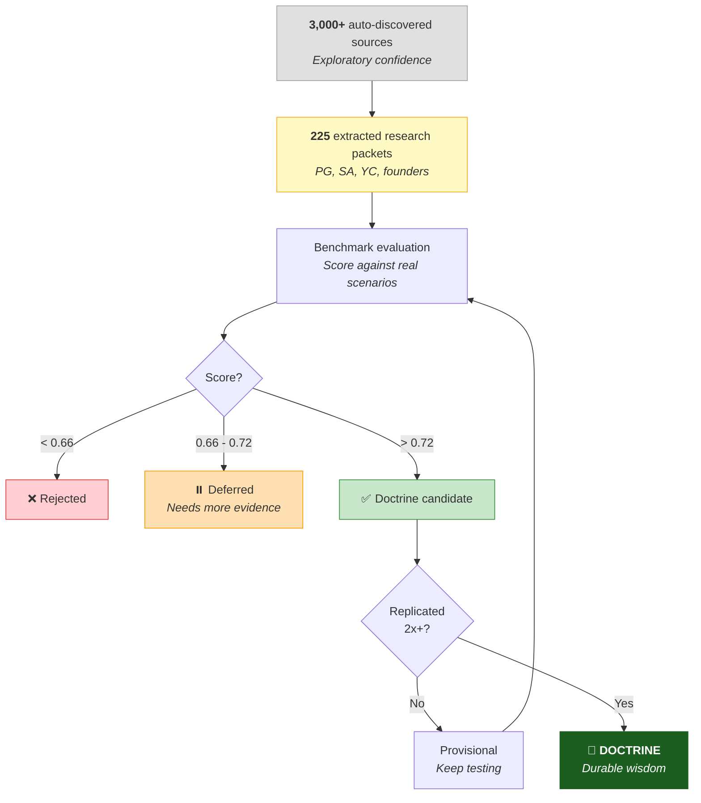

**Design Brief:**
Funnel visualization. Wide at top (3,000+ sources), narrowing dramatically. Show the numbers shrinking at each stage. Color-code: gray (raw) → yellow (extracted) → green (promoted) → dark green (doctrine). Side annotations show the score thresholds (0.66 / 0.72). The reject and defer branches should be visible but clearly secondary paths. Key insight to highlight: "Only replicated improvements earn permanent doctrine status."

---

## Visual 9: Contradiction Tracking (What Makes This Special)

**Placement:** Within the domain-chip section or as a callout box

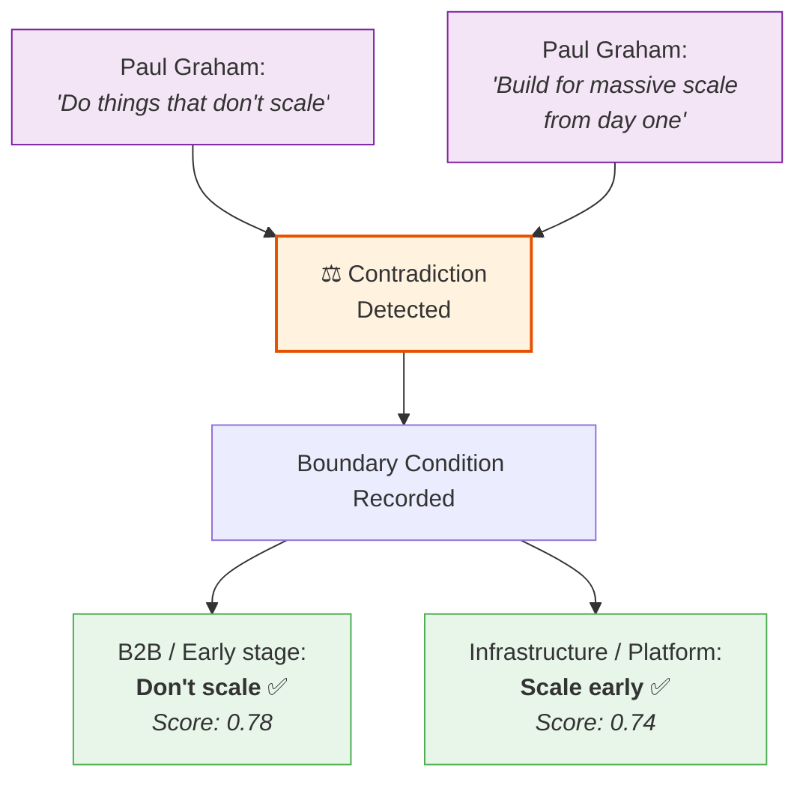

**Design Brief:**
Two quote bubbles at top, each with a real PG quote that seemingly contradicts. An "intersection" node in the middle labeled "Contradiction detected." Below, two resolution cards showing *when each advice applies* with context and scores. Caption: "Most AI picks one side. Spark learns when each applies." This is the money visual — it shows genuine understanding vs pattern matching.

---

## Visual 10: Spark vs Fine-Tuning vs RAG

**Placement:** "Isn't this just fine-tuning?" section — as an infographic

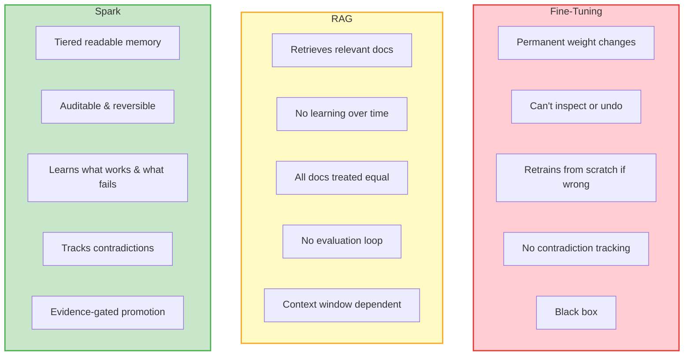

**Design Brief:**
Three columns comparison chart. Left = Fine-Tuning (red-tinted, "permanent ink" metaphor icon). Center = RAG (yellow-tinted, "search engine" metaphor icon). Right = Spark (green-tinted, "filing cabinet with rules" metaphor icon). Each column has 5 attributes with checkmarks/x-marks. Spark column slightly elevated or highlighted. Bottom row: a one-sentence verdict for each. "Permanent ink." / "Good librarian, no judgment." / "Filing cabinet that earns trust."

---

## Visual 11: The Collective Intelligence Network

**Placement:** "Where this is going" section

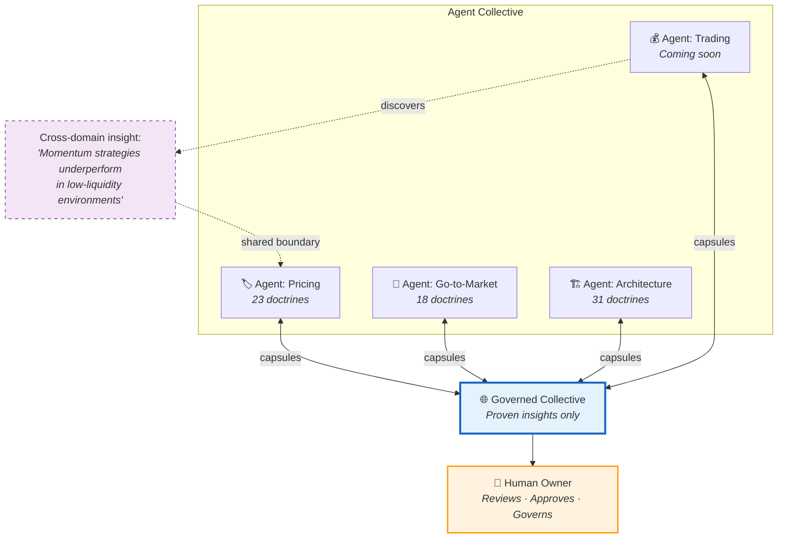

**Design Brief:**
Network/mesh diagram. 4+ agent nodes arranged in a circle, each with a specialization label and doctrine count. Center hub = "Governed Collective." Lines connecting each agent to the hub (bidirectional, labeled "capsules"). One special dotted line showing a cross-domain insight transfer — e.g., trading agent's discovery helping startup agent. Human owner node above/outside the mesh with governance arrows. Feel: collaborative, organic, like a neural network but readable.

---

## Visual 12: The Workshop Owner Principle

**Placement:** "Workshop owner principle" section

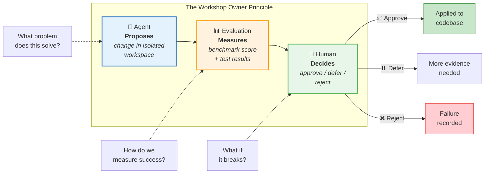

**Design Brief:**
Three-step horizontal flow with large icons. Left: robot/AI icon labeled "Proposes." Center: chart/gauge icon labeled "Measures." Right: person icon labeled "Decides." Below each step, the corresponding question in a speech bubble. Three outcome branches from the decision node: approve (green arrow down), defer (yellow arrow right), reject (red arrow with "failure recorded" note). Clean, reassuring design that makes governance feel natural, not bureaucratic.

---

## Recommended Placement Summary

| # | Visual | Article Section | Type |
|---|--------|----------------|------|
| 1 | Parrot vs Partner | Hero / Opening | Editorial illustration |
| 2 | Three-Repo Ecosystem | "Three repos, one mission" | Architecture diagram |
| 3 | Learning Loop | After "Three repos" | Circular flow |
| 4 | Memory Pyramid | "Fine-tuning" section | Pyramid/stacked chart |
| 5 | Skills vs Spark | "Claude Skills" section | Side-by-side comparison |
| 6 | User Journey | "In practice" section | Horizontal timeline |
| 7 | Governance Spectrum | Spark-swarm or Workshop Owner | Slider/gradient |
| 8 | Doctrine Funnel | "Fine-tuning" or sidebar | Funnel visualization |
| 9 | Contradiction Tracking | Domain chip section | Flow diagram |
| 10 | Spark vs Fine-Tuning vs RAG | "Fine-tuning" section | 3-column comparison |
| 11 | Collective Network | "Where this is going" | Network/mesh |
| 12 | Workshop Owner Principle | "Workshop owner" section | 3-step flow |

## Design Notes

**Color palette:**
- spark-swarm: Blues (#E3F2FD → #1565C0)
- spark-researcher: Ambers (#FFF3E0 → #FF9800)
- domain-chip: Greens (#E8F5E9 → #1B5E20)
- Rejections/failures: Reds (#FFCDD2 → #E53935)
- Neutral/legacy: Grays (#F5F5F5 → #9E9E9E)

**Typography:** Use the same font as the article. Diagram labels should be readable at blog-post width (~700px). Bold for key terms, italic for descriptions.

**Tone:** Approachable, not corporate. Think Linear, Vercel, or Stripe blog posts — clean, slightly playful, but information-dense. Avoid clip art or stock illustration vibes.

**Format priority:**
1. Mermaid (renders on GitHub, Notion, most CMS) — included above
2. SVG exports from Mermaid for static publishing
3. Figma polished versions for landing pages or pitch decks
